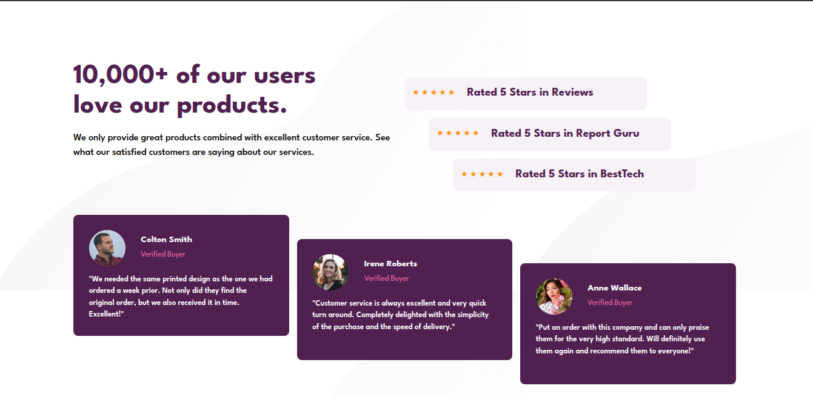

# Frontend Mentor - Social proof section solution

This is a solution to the [Social proof section challenge on Frontend Mentor](https://www.frontendmentor.io/challenges/social-proof-section-6e0qTv_bA). Frontend Mentor challenges help you improve your coding skills by building realistic projects. 

## Table of contents

- [Overview](#overview)
  - [The challenge](#the-challenge)
  - [Screenshot](#screenshot)
  - [Links](#links)
- [My process](#my-process)
  - [Built with](#built-with)
  - [What I learned](#what-i-learned)
  - [Continued development](#continued-development)

- [Author](#author)

## Overview

### The challenge

Users should be able to:

- View the optimal layout for the section depending on their device's screen size

### Screenshot

### Links

- Solution URL: [Solution URL here](https://github.com/rajin-siam/.comsocial-proof-section-master)
- Live Site URL: [Live site URL here](https://rajin-siam.github.io/social-proof-section)

## My process

### Built with

- Semantic HTML5 markup
- CSS custom properties
- Flexbox
- Mobile-first workflow

### What I learned
 Got to know about why using height and weight of parent and child elements are important

### Continued development

Will use tailwind css next time

## Author

- Website - [Md. Rajin Mashrur Siam](https://rajin-siam-portfolio.netlify.app/)
- Frontend Mentor - [@rajinsiam](https://www.frontendmentor.io/profile/rajin-siam)

